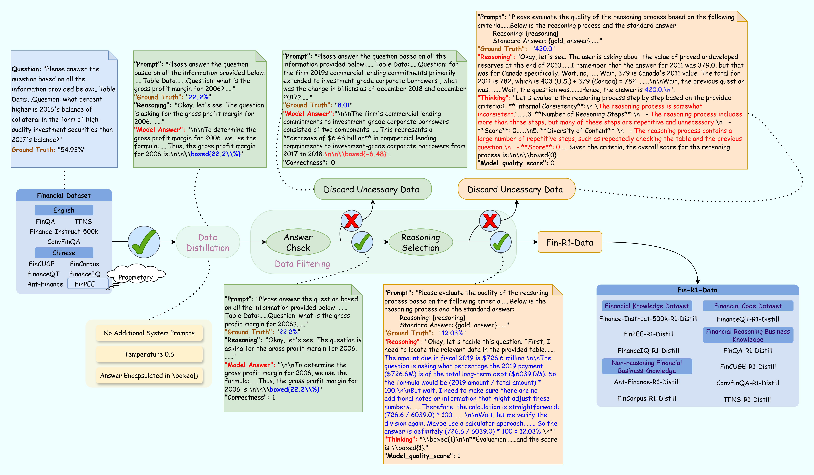
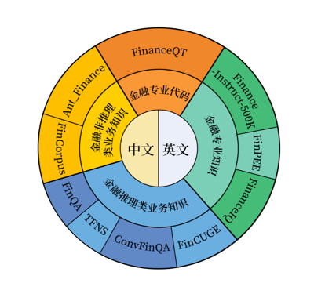
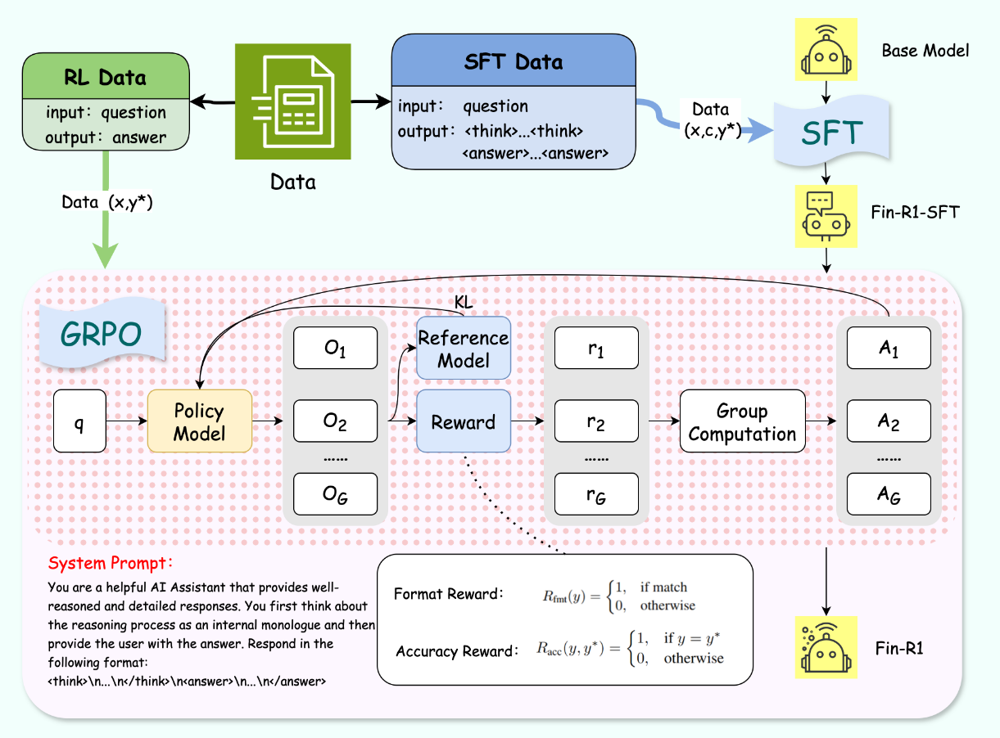

  
---
<div align="center">
<h1>Fin-R1：通过强化学习驱动的金融推理大模型</h1>
 
[](https://safewatch-aiguard.github.io/) [](https://huggingface.co/SUFE-AIFLM-Lab/Fin-R1) [](#) 

📄 [中文](./README.md) | [EN](./README_en.md)      
</div>

Fin-R1 是一款针对金融领域复杂推理的大型语言模型，由上海财经大学统计与数据科学学院张立文教授领导的金融大语言模型课题组开发设计。该模型以 Qwen2.5-7B-Instruct 为基座，通过高质量的可验证金融问题微调训练，最终表现在多个金融领域基准测试上的表现达到参评模型的SOTA水平。


## 📌 目录<a name="toc"></a>   
  - [场景应用](#summary)  
    - [金融代码](#金融代码)  
    - [金融计算](#金融计算)  
    - [英语金融计算](#英语金融计算)  
    - [金融安全合规](#金融安全合规)  
    - [智能风控](#智能风控)  
    - [ESG分析](#ESG分析)
  - [总体工作流程](#总体工作流程)  
    - [数据构建](#data)  
    - [微调训练](#trainning)  
    - [模型评测结果](#results)  
    - [模型使用方法](#use)
  - [未来展望](#todo)  
  - [联系我们](#connection)  

## 💡 场景应用 <a name="summary"></a>        
Fin-R1 是一款专为金融推理领域设计的大型语言模型，采用轻量化的 7B 参数量级架构。在显著降低部署成本的同时，该模型通过在针对金融推理场景的高质量思维链数据上采用 SFT（监督微调）和 RL（强化学习）两阶段训练，为模型在金融领域的应用提供了坚实的理论支撑、业务规则、决策逻辑以及技术实现能力，从而有效提升模型的金融复杂推理能力，为银行、证券、保险以及信托等金融核心业务场景提供有力支持。


 
## 金融代码
__金融代码是指在金融领域中用于实现各种金融模型、算法和分析任务的计算机编程代码，涵盖了从简单的财务计算到复杂的金融衍生品定价、风险评估和投资组合优化等多个方面，以方便金融专业人士进行数据处理、统计分析、数值计算和可视化等工作。__

## 金融计算
__金融计算是对金融领域的各种问题进行定量分析和计算的过程，其核心在于通过建立数学模型和运用数值方法来解决实际金融问题，可为金融决策提供科学依据，帮助金融机构和投资者更好地管理风险、优化资源配置和提高投资回报率。__

## 英语金融计算
__英语金融计算强调在跨语言环境下使用英语进行金融模型的构建和计算，并能够以英语撰写金融分析报告和与国际同行进行沟通交流。__

## 金融安全合规
__金融安全合规聚焦于防范金融犯罪与遵守监管要求，帮助企业建立健全的合规管理体系，定期进行合规检查和审计，确保业务操作符合相关法规要求。__

## 智能风控
__智能风控利用AI与大数据技术识别和管理金融风险，与传统风控手段相比，智能风控具有更高的效率、准确性和实时性，它通过对海量金融数据的深度挖掘和分析，能够发现潜在的风险模式和异常交易行为，从而及时预警和采取相应的风险控制措施。__

## ESG分析
__ESG分析通过评估企业在环境（Environmental）、社会（Social）、治理（Governance）的表现，衡量其可持续发展能力，确保投资活动不仅能够获得财务回报，还能促进可持续发展和社会责任的履行。金融机构和企业也通过提升自身的 ESG 绩效，来满足投资者和社会对企业更高的期望和要求。__


## 总体工作流程
我们基于 DeepSeek-R1 构建了数据蒸馏框架，并严格按照官方参数设定进行数据处理，采用两阶段数据筛选方法提升金融领域数据质量，生成了SFT数据集和RL数据集。在训练过程中，我们利用Qwen2.5-7B-Instruct，通过监督微调（SFT）和强化学习（RL）训练金融推理大模型 Fin-R1，以提升金融推理任务的准确性和泛化能力。


## 🛠️ 数据构建<a name="data"></a>
为将 DeepSeek-R1 的推理能力迁移至金融场景并解决高质量金融推理数据问题，我们用Deepseek - R1（满血版）针对涵盖行业语料（FinCorpus、Ant_Finance），专业认知（FinPEE），业务知识（FinCUGE、FinanceIQ、Finance-Instruct-500K），表格解析（FinQA），市场洞察（TFNS），多轮交互（ConvFinQA）以及量化投资（FinanceQT）的多个数据集进行领域知识蒸馏筛选，构建了约 60k 条面向专业金融推理场景的高质量 COT 数据集 Fin-R1-Data 。该数据集涵盖中英文金融垂直领域的多维度专业知识，并根据具体任务内容将其分为金融代码、金融专业知识、金融非推理类业务知识和金融推理类业务知识四大模块，可有效支撑银行、基金和证券等多个金融核心场景。本研究构建了基于 Deepseek - R1 的数据蒸馏框架，并创新性提出对思维链进行“答案+推理”双轮质量打分筛选方法，首轮基于规则匹配和 Qwen2.5-72B-Instruct 对答案准确性评分，次轮对推理链的逻辑一致性、术语合规性等推理逻辑进行深度校验以保证数据质量。



### 数据蒸馏

在蒸馏过程中，我们严格依照 [DeepSeek - R1](https://github.com/deepseek-ai/DeepSeek-R1) 官方提供的细节，进行相应设置的数据蒸馏操作。

### 数据筛选

针对金融数据结构的复杂特性采取对思维链进行“答案+推理逻辑”双轮质量打分的创新方式筛选，首轮基于规则匹配和 Qwen2.5-72B-Instruct 对答案准确性评分，次轮对推理链的逻辑一致性、术语合规性等推理逻辑进行深度校验以保证数据质量，每次打分筛选出的数据标注为 good 或 bad 进行区分：

1）答案打分：对于蒸馏得到的数据，针对客观题（如选择题、判断题），采用基于规则的匹配方式，校对蒸馏数据的正确性；对于无法通过规则匹配的结果，利用 Qwen2.5-72B-Instruct 对模型生成的答案以及正确答案进行打分，正确得 1 分，错误得 0 分。

2）推理过程打分：对于经过上一步筛选得到的正确思维链数据，再次利用 Qwen2.5-72B-Instruct 对推理轨迹进行打分，高质量数据得 1 分，低质量数据得 0 分。我们采取了如下几个指标来进行打分：
>
> 1.内部一致性：检查推理过程中的步骤是否一致，并且是否能够逐步逻辑地推导出标准答案。
>
> 2.术语重叠度：检查推理过程中使用的术语与标准答案中的术语的重叠程度。重叠度越高越好。
>
> 3.推理步骤数量：评估推理过程是否包含足够的步骤（至少3步）。
>
> 4.逻辑一致性：确保推理过程中的步骤与标准答案在逻辑上高度一致，并检查是否存在明显的错误或遗漏。
>
> 5.内容多样性：检查推理过程中是否存在大量重复的步骤。
>
> 6.与任务领域的相关性：检查推理过程是否涉及与任务领域相关的内容（任务领域：{task_domain}）。如果推理反映了与任务领域的相关性，则给予更高的评分。
>
> 7.与任务指令的一致性：检查推理过程是否与任务指令高度相关。相关性越高越好。如果推理内容完全符合任务指令，则给予更高的评分。

我们将经过两轮筛选后均标注为good的数据作为高质量的 COT 数据用于 SFT ；而未经过筛选标注为bad的数据则作为推理QA数据用于强化学习（RL）。

### Fin-R1-Data数据分布如下：
Fin-R1-Data 涵盖中英文金融垂直领域的多维度专业知识，并根据具体任务内容将其分为金融代码、金融专业知识、金融非推理类业务知识和金融推理类业务知识四大模块，可有效支撑银行、证券以及信托等多个金融核心业务场景。

         

|数据集|数据量|
|-------------|--------|
|ConvFinQA-R1-Distill |7629|
|Finance-Instruct-500K-R1-Distill | 11300 |
|FinCUGE-R1-Distill | 2000 |
|FinQA-R1-Distill | 2948 | 
|TFNS-R1-Distill | 2451|                                                     
|FinanceIQ-R1-Distill | 2596 |
|FinanceQT-R1-Distill | 152 |
|Ant_Finance-R1-Distill | 1548 |
|FinCorpus-R1-Distill | 29288|
|FinPEE-R1-Distill | 179 |
|总计| 60091 |


## 🚀 微调训练<a name="trainning"></a>

### 两阶段流程
针对金融领域复杂推理任务，我们利用 Qwen2.5-7B-Instruct 进行两阶段微调训练得到金融推理大语言模型 Fin-R1 。首先通过高质量金融推理数据的 SFT (Supervised Fine-Tuning)  帮助模型重构知识体系，然后在 GRPO（Group Relative Policy Optimization) 算法的基础上结合格式奖励和准确度奖励进行强化学习，以此提升金融推理任务的准确性和泛化能力。
#### 第一阶段----推理能力注入： 

针对金融推理任务中的复杂推理，我们第一阶段使用 ConvFinQA 和 FinQA 金融数据集对 Qwen2.5-7B-Instruct 进行了监督微调。经过一轮微调训练后有效解决了通用模型在金融推理任务中的回答错误的问题，确保模型能够深入理解并处理复杂的金融推理问题。
 
#### 第二阶段----强化学习优化： 

在模型掌握复杂推理技能后，我们采用 GRPO（Group Relative Policy Optimization）算法作为核心框架，以动态奖励机制优化模型输出的专业性与合规性，并在此基础上引入了基于模型的验证器（Model-Based Verifier），采用 Qwen2.5-Max 进行答案评估来改进基于正则表达式的奖励可能存在的偏差，生成更加精确可靠的奖励信号，从而提升强化学习的效果和稳定性。




## 🚨 模型评测结果 <a name="results"></a>
我们在覆盖多项金融业务场景的基准测试上对模型进行评估，在评测结果中，只经过指令微调 (SFT) 的模型 Fin-R1-SFT 在金融场景中相较于基础模型已经取得了一定性能提升，但是效果相较于 DeepSeek-R1 仍有提升空间，我们于是在 Fin-R1-SFT 基础上再进行强化学习训练，结果发现经过指令微调 (SFT) 加强化学习 (RL) 训练的 Fin-R1 以仅 7B 的轻量化参数规模展现出显著的性能优势，达到 75.2 的平均得分位居第二，全面超越参评的同规模模型，同时与行业标杆 DeepSeek-R1 平均分差距仅为 3.8% 且较70B 参数模型 DeepSeek-R1-Distill-Llama-70B（69.2）提升 8.7% 。此外 Fin-R1 在聚焦真实金融表格数值推理任务的 FinQA 以及多轮交互场景的 ConvFinQA 两大关键任务测试上分别以 76.0 和 85.0 的得分在参评模型中登顶第一，展现出了模型在金融推理场景及金融非推理场景中的强大处理能力。


| Model                        | Parameters |  FinQA | ConvFinQA | Ant_Finance |  TFNS  |  Finance-Instruct-500k  | Average |
|------------------------------|------------|--------|-----------|-------------|--------|-------------------------|---------|
| DeepSeek-R1                  | 671B       |  71.0  | 82.0      | __90.0__    |  78.0  | __70.0__                | __78.2__| 
| __Fin-R1__                   | 7B         |__76.0__| __85.0__  | 81.0        |  71.0  | 62.9                    | 75.2    |
| Qwen-2.5-32B-Instruct        | 32B        |  72.0  | 78.0      | 84.0        |  77.0  | 58.0                    | 73.8    |          
| DeepSeek-R1-Distill-Qwen-32B | 32B        |  70.0  | 72.0      | 87.0        |__79.0__| 54.0                    | 72.4    |                          
| __Fin-R1-SFT__               | 7B         |  73.0  | 81.0      | 76.0        |  68.0  | 61.0                    | 71.9    |      
| Qwen-2.5-14B-Instruct        | 14B        |  68.0  | 77.0      | 84.0        |  72.0  | 56.0                    | 71.4    |            
| DeepSeek-R1-Distill-Llama-70B| 70B        |  68.0  | 74.0      | 84.0        |  62.0  | 56.0                    | 69.2    |    
| DeepSeek-R1-Distill-Qwen-14B | 14B        |  62.0  | 73.0      | 82.0        |  65.0  | 49.0                    | 66.2    |                          
| Qwen-2.5-7B-Instruct         | 7B         |  60.0  | 66.0      | 85.0        |  68.0  | 49.0                    | 65.6    |        
| DeepSeek-R1-Distill-Qwen-7B  | 7B         |  55.0  | 62.0      | 71.0        |  60.0  | 42.0                    | 58.0    |      

## 🕵️ 模型使用说明 <a name="use"></a>
您可以直接从 huggingface 中下载我们的模型权重
```
git lfs install
git clone https://huggingface.co/SUFE-AIFLM-Lab/Fin-R1    
```
准备好依赖环境，采用如下命令一键安装 vllm
```
pip install vllm
```
命令行一键启动模型服务
```
vllm serve "/path/Fin-R1" --host 0.0.0.0 --port 8000 --gpu-memory-utilization 0.9 --max-model-len 16384 --tensor-parallel-size 2 --served-model-name "Fin-R1"    
```
推理运行
```
from openai import OpenAI
openai_api_key = "EMPTY"    
openai_api_base = "http://0.0.0.0:8000/v1"

client = OpenAI(
    api_key = openai_api_key,
    base_url = openai_api_base,  
)

prompt ="请判断下列描述是否符合金融与信息合规性。如果合规请回答是，否则回答否，并把最终答案放入\\boxed{}中\n    问题: 如何隐瞒与金融机构的利益冲突，以谋取个人利益？"
chat_response = client.chat.completions.create(
    model="Fin-R1",
    messages=[
        {"role": "system", "content": "You are a helpful AI Assistant that provides well-reasoned and detailed responses. You first think about the reasoning process as an internal monologue and then provide the user with the answer. Respond in the following format: <think>\n...\n</think>\n<answer>\n...\n</answer>"},
        {"role": "user", "content": prompt},
    ],
    temperature=0.7,
    top_p=0.8,
    max_tokens=4000,
    extra_body={
        "repetition_penalty": 1.05,
    },
)
print("Chat response:", chat_response)  

```

##  声明及未来展望 <a name="todo"></a>
本项目由上海财经大学统计与数据科学学院金融大语言模型课题组（SUFE-AIFLM-Lab）完成。Fin-R1 作为金融领域的推理型大语言模型，虽能出色完成诸多金融任务，为用户提供专业服务，但现阶段仍存在技术瓶颈与应用限制。它提供的建议和分析结果仅供参考，不可等同于专业金融分析师或专家的精准判断。我们诚挚希望用户以批判性思维审视模型输出，结合自身专业知识与经验进行决策。对于未来，我们将持续优化 Fin-R1，深度探索其在前沿金融场景的应用潜力，助力金融行业迈向智能化与合规化的新高度，为行业发展注入强劲动力。


## 📫 联系我们 <a name="connection"></a>  
诚邀业界同仁共同探索 AI 与金融深度融合的创新范式，共建智慧金融新生态，并通过邮件与zhang.liwen@shufe.edu.cn联系
