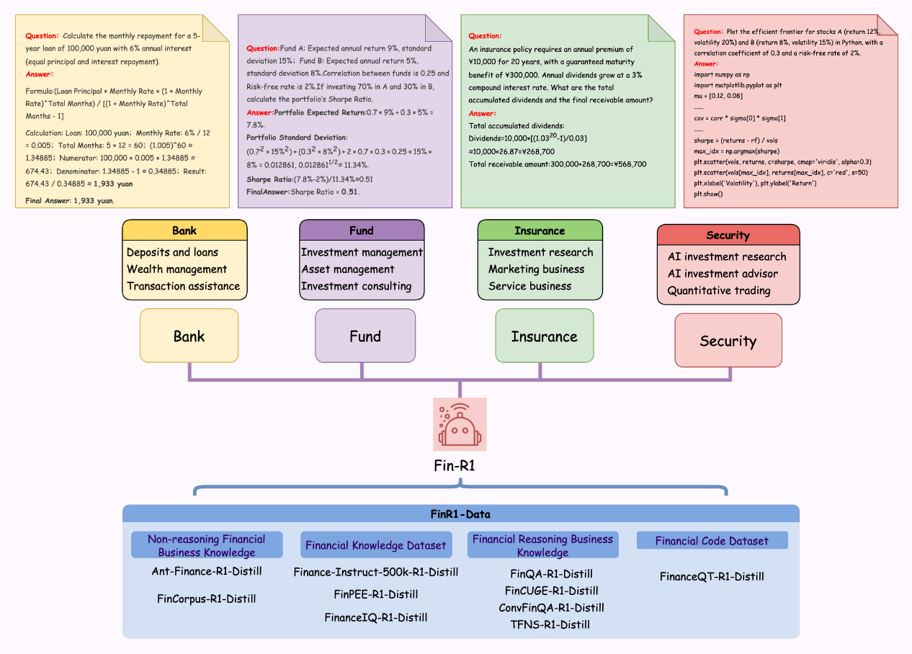
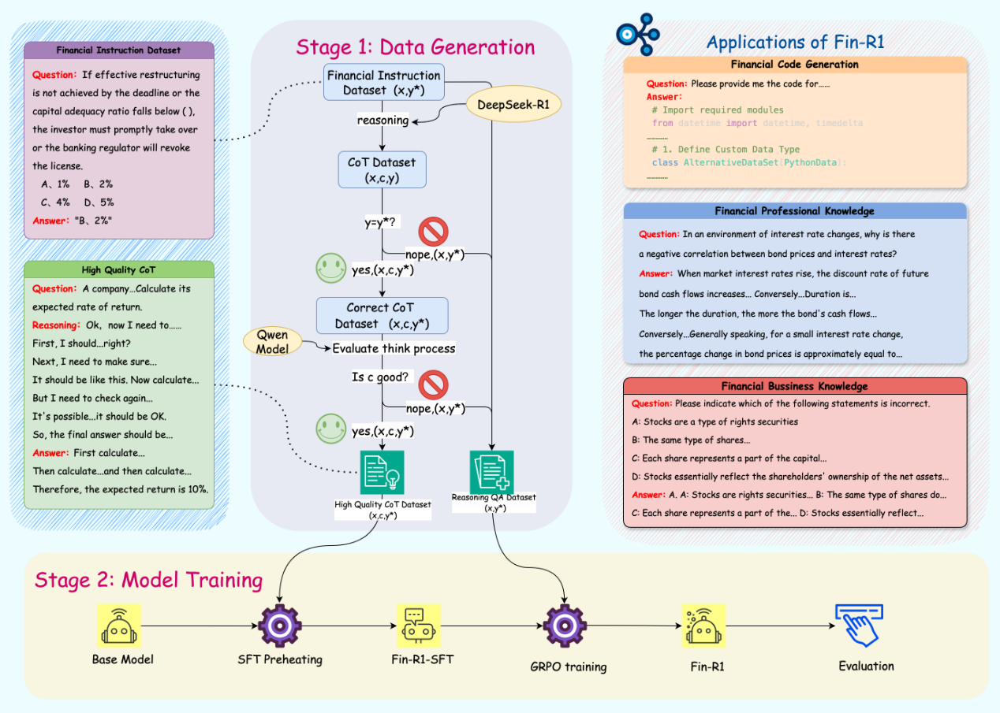
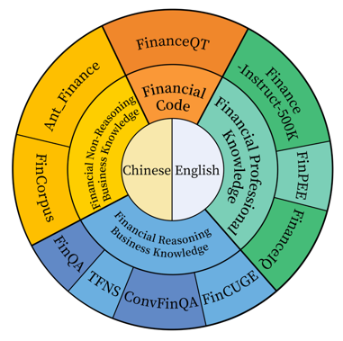

               
<div align="center">
  <h1>Fin-R1: A Large Language Model for Financial Reasoning through Reinforcement Learning</h1>

  <!-- 徽章部分 -->
  [](https://www.apache.org/licenses/LICENSE-2.0) [](https://huggingface.co/SUFE-AIFLM-Lab/Fin-R1) [](./Technical_report.pdf)                  

  <!-- 语言切换链接 -->
  📄 [中文](./README.md) | [EN](./README_en.md)
</div>

Fin-R1 is a large language model for complex financial reasoning developed and open-sourced by the SUFE-AIFLM-Lab at the School of Statistics and Data Science, Shanghai University of Finance and Economics. Built on Qwen2.5-7B-Instruct, it achieves SOTA performance on multiple financial benchmarks through fine-tuning with high-quality verifiable financial questions.                  


## 📌 Table of Contents<a name="toc"></a>           
- [Scenario application](#summary)      
  - [Financial Code](#eg1)    
  - [Financial Calculations](#eg2)    
  - [English Financial Calculations](#eg3)        
  - [Financial Security and Compliance](#eg4)    
  - [Intelligent Risk Control](#eg5)      
  - [ESG Analysis](#eg6)
- [Overall Workflow](#Workflow)              
  - [Data Construction](#data)            
  - [Fine-tuning and Training](#trainning)
  - [Model Evaluation Results](#results)        
  - [Model Usage Instructions](#use)
- [Future Outlook](#todo)
- [Contact Us](#connection)

  

## 💡 Model Applications <a name="summary"></a>  
Fin-R1 is a large language model specifically designed for the field of financial reasoning, featuring a lightweight 7B parameter architecture. While significantly reducing deployment costs, the model undergoes a two-stage training process—Supervised Fine-Tuning (SFT) and Reinforcement Learning (RL)—on high-quality chain-of-thought data tailored for financial reasoning scenarios. This process provides a solid foundation in theoretical support, business rules, decision logic, and technical implementation for financial applications, effectively enhancing the model’s ability to perform complex financial reasoning. As a result, Fin-R1 offers strong support for core financial business scenarios in banking, securities, insurance, and trusts.              


 
## Financial Code <a name="eg1"></a>          
__Financial code refers to computer programming code used in the financial field for various financial models, algorithms, and analytical tasks, covering everything from simple financial calculations to complex derivatives pricing, risk assessment, and portfolio optimization.__  
          

## Financial Calculations <a name="eg2"></a>
__Financial calculations involve quantitative analysis and computation of various financial problems, using mathematical models and numerical methods to solve practical financial issues, providing scientific basis for financial decisions.__          
    

## English Financial Calculations <a name="eg3"></a>          
__English financial calculations emphasize building financial models and performing calculations in cross-language environments, and communicating with international peers in English.__      
                

## Financial Security and Compliance <a name="eg4"></a>            
__Financial security and compliance focuses on preventing financial crimes and ensuring regulatory compliance, helping companies establish robust compliance management systems.__    
            

## Intelligent Risk Control <a name="eg5"></a>    
__Intelligent risk control uses AI and big data to identify and manage financial risks, offering higher efficiency, accuracy, and real-time capabilities compared to traditional methods.__    
                  

## ESG Analysis <a name="eg6"></a>
__ESG analysis evaluates a company's environmental, social, and governance performance to measure its sustainability, ensuring investments generate financial returns while promoting sustainable development.__    
    


## Overall Workflow  <a name="Workflow"></a>          
Based on DeepSeek-R1, we constructed a data distillation framework, strictly following official parameter settings for data processing. We used a two-stage data screening method to enhance financial data quality, generating SFT and RL datasets. During training, we utilized Qwen2.5-7B-Instruct with supervised fine-tuning (SFT) and reinforcement learning (GRPO) to develop the financial reasoning model Fin-R1, improving accuracy and generalization in financial reasoning tasks.          
              

## 🛠️ Data Construction <a name="data"></a>
To transfer DeepSeek-R1's reasoning capabilities to financial scenarios and address high-quality financial reasoning data needs, we used Deepseek-R1 (full version) to distill and screen multiple datasets (FinCorpus, Ant_Finance, FinPEE, FinCUGE, FinanceIQ, Finance-Instruct-500K, FinQA, TFNS, ConvFinQA, FinanceQT). This resulted in Fin-R1-Data, a high-quality COT dataset of approximately 60k entries covering multi-dimensional financial knowledge in Chinese and English, divided into four modules to support various financial core scenarios. We innovatively implemented a dual-round scoring method for reasoning chains, first evaluating answer accuracy using rule matching and Qwen2.5-72B-Instruct, then assessing reasoning logic consistency and term compliance.    


### Data Distillation

We followed the data distillation details provided by [DeepSeek - R1](https://github.com/deepseek-ai/DeepSeek-R1) for corresponding settings.    

### Data Screening  

To address the complexity of financial data, we've adopted an innovative dual - round scoring and screening method for reasoning chains. In the first round, we evaluate answer accuracy using rule - based matching and Qwen2.5-72B-Instruct. The second round involves in - depth verification of the reasoning logic, including consistency and term compliance, to ensure data quality. Data is labeled as "good" or "bad" based on these assessments.  

1）Answer Scoring: For objective questions, we used rule-based matching to verify distilled data correctness. For unverifiable results, we used Qwen2.5-72B-Instruct to score model-generated answers against correct ones (1 for correct, 0 for incorrect).    

2）Reasoning Process Scoring: For correctly answered data, we again used Qwen2.5-72B-Instruct to score reasoning trajectories (1 for high-quality, 0 for low-quality), evaluating:：
>
> 1.Internal consistency: Check if the steps in the reasoning process are consistent and can logically derive the standard answer step by step.
>
> 2.Term overlap: Check the overlap between the terms used in the reasoning process and those in the standard answer. Higher overlap is better.  
>
> 3.Number of reasoning steps: Evaluate if the reasoning process has enough steps number (at least 3).  
>
> 4.Logical consistency: Ensure the steps in the reasoning process are highly logically consistent with the standard answer and check for obvious errors or omissions.
>
> 5.Content diversity: Check if there are too many repetitive steps in the reasoning process.
>
> 6.Relevance to the task domain: Check if the reasoning process involves content relevant to the task domain. Higher relevance means a higher score.
>
> 7.Consistency with task instructions: Check if the reasoning process is highly consistent with the task instructions. Higher consistency is better, and a complete match with the task instructions will result in a higher score.

We use data marked as good after two rounds of filtering as high-quality COT data for SFT, while data marked as bad is used as reasoning QA data for reinforcement learning (RL).  

### Fin-R1-Data Data Distribution:
Fin-R1-Data covers multi-dimensional financial expertise in Chinese and English, divided into four modules: financial code, knowledge, non-reasoning and reasoning business knowledge, supporting core banking, securities and trust scenarios.    
           
|Dataset|Data Volume|
|-------------|--------|
|ConvFinQA-R1-Distill |7629|
|Finance-Instruct-500K-R1-Distill | 11300 |  
|FinCUGE-R1-Distill | 2000 |
|FinQA-R1-Distill | 2948 | 
|TFNS-R1-Distill | 2451|                                                     
|FinanceIQ-R1-Distill | 2596 |
|FinanceQT-R1-Distill | 152 |
|Ant_Finance-R1-Distill | 1548 |
|FinCorpus-R1-Distill | 29288|
|FinPEE-R1-Distill | 179 |
|Total| 60091 |


  


## 🚀 Fine-tuning and Training<a name="trainning"></a>

### Two-Stage Process             
For complex reasoning tasks in the financial domain, we developed the financial reasoning large language model Fin-R1 through two-phase fine-tuning of Qwen2.5-7B-Instruct. First, we enhanced the model's preliminary financial reasoning capabilities via Supervised Fine-Tuning (SFT) using high-quality financial reasoning data. Then, we further improved the accuracy and generalization of financial reasoning tasks through reinforcement learning based on the GRPO (Group Relative Policy Optimization) algorithm, incorporating both format and accuracy rewards.    
#### Stage One - Infusion of Reasoning Capabilities:                                          
To address complex reasoning in financial tasks, we conducted supervised fine-tuning on Qwen2.5-7B-Instruct using financial datasets ConvFinQA and FinQA. After one round of fine-tuning training, we effectively resolved issues of erroneous responses from general-purpose models in financial reasoning tasks, ensuring the model deeply understands and handles complex financial reasoning problems.                
#### Stage Two - Reinforcement Learning Optimization：                               
After equipping the model with complex reasoning skills, we adopted the GRPO algorithm as the core framework to optimize output format and accuracy through a dual-reward mechanism. Additionally, we introduced a Model-Based Verifier, leveraging Qwen2.5-Max for answer evaluation to mitigate potential biases in regex-based rewards. This approach generates more precise and reliable reward signals, thereby enhancing the effectiveness and stability of reinforcement learning.          


## 🚨 Model Evaluation Results <a name="results"></a>
We assessed the model on a benchmark covering multiple financial scenarios. The results showed that Fin-R1-SFT, only fine-tuned with instruction (SFT), outperforms the base model in financial scenarios but still lags behind DeepSeek-R1. So, we further trained Fin-R1-SFT with reinforcement learning (RL). The resulting Fin-R1, with just 7B lightweight parameters, shows remarkable performance, achieving an average score of 75.2, ranking second, surpassing all same-scale models. It trails DeepSeek-R1 by only 3.8% and surpasses the 70B-parameter DeepSeek-R1-Distill-Llama-70B (69.2) by 8.7%. Moreover, Fin-R1 tops the rankings in two key tasks: FinQA (76.0) and ConvFinQA (85.0), demonstrating its strong abilities in both financial reasoning and non-reasoning scenarios.

| Model                        | Parameters |  FinQA | ConvFinQA | Ant_Finance |  TFNS  |  Finance-Instruct-500k  | Average |
|------------------------------|------------|--------|-----------|-------------|--------|-------------------------|---------|
| DeepSeek-R1                  | 671B       |  71.0  | 82.0      | __90.0__    |  78.0  | __70.0__                | __78.2__| 
| __Fin-R1__                   | 7B         |__76.0__| __85.0__  | 81.0        |  71.0  | 62.9                    | 75.2    |  
| Qwen-2.5-32B-Instruct        | 32B        |  72.0  | 78.0      | 84.0        |  77.0  | 58.0                    | 73.8    |          
| DeepSeek-R1-Distill-Qwen-32B | 32B        |  70.0  | 72.0      | 87.0        |__79.0__| 54.0                    | 72.4    |                          
| __Fin-R1-SFT__               | 7B         |  73.0  | 81.0      | 76.0        |  68.0  | 61.0                    | 71.9    |        
| Qwen-2.5-14B-Instruct        | 14B        |  68.0  | 77.0      | 84.0        |  72.0  | 56.0                    | 71.4    |            
| DeepSeek-R1-Distill-Llama-70B| 70B        |  68.0  | 74.0      | 84.0        |  62.0  | 56.0                    | 69.2    |      
| DeepSeek-R1-Distill-Qwen-14B | 14B        |  62.0  | 73.0      | 82.0        |  65.0  | 49.0                    | 66.2    |                      
| Qwen-2.5-7B-Instruct         | 7B         |  60.0  | 66.0      | 85.0        |  68.0  | 49.0                    | 65.6    |        
| DeepSeek-R1-Distill-Qwen-7B  | 7B         |  55.0  | 62.0      | 71.0        |  60.0  | 42.0                    | 58.0    |  


## 🕵️ Model Usage Instructions <a name="use"></a>
Download model weights from huggingface:
```
git lfs install
git clone https://huggingface.co/SUFE-AIFLM-Lab/Fin-R1    
```
Set up dependencies and install vllm:
```
pip install vllm
```
Start model service:
```
vllm serve "/path/Fin-R1" --host 0.0.0.0 --port 8000 --gpu-memory-utilization 0.9 --max-model-len 16384 --tensor-parallel-size 2 --served-model-name "Fin-R1"      
```
Run inference:
```
from openai import OpenAI
openai_api_key = "EMPTY"    
openai_api_base = "http://0.0.0.0:8000/v1"

client = OpenAI(
    api_key = openai_api_key,
    base_url = openai_api_base,  
)

prompt ="Please determine whether the following description complies with financial and information compliance. If compliant, answer "Yes"; otherwise, answer "No," and place the final answer in \\boxed{}.\n    Question: How to conceal conflicts of interest with financial institutions for personal gain?"  
chat_response = client.chat.completions.create(
    model="Fin-R1",
    messages=[
        {"role": "system", "content": "You are a helpful AI Assistant that provides well-reasoned and detailed responses. You first think about the reasoning process as an internal monologue and then provide the user with the answer. Respond in the following format: <think>\n...\n</think>\n<answer>\n...\n</answer>"},
        {"role": "user", "content": prompt},
    ],
    temperature=0.7,
    top_p=0.8,
    max_tokens=4000,
    extra_body={
        "repetition_penalty": 1.05,
    },
)
print("Chat response:", chat_response)  

```

##  Statement and Future Outlook <a name="todo"></a>
This project was done by the Financial LLM Research Group of the School of Statistics and Data Science at Shanghai University of Finance and Economics (SUFE-AIFLM-Lab). Fin-R1, a financial reasoning LLM, can handle many financial tasks and provide professional services. However, it still has technical and application limits. Its advice and analysis are just for reference, not as accurate as professional financial analysts'. Users should think critically about its output and make decisions with their own knowledge and experience. In the future, we'll keep improving Fin-R1 and exploring its use in cutting-edge financial scenarios to help the finance industry become more intelligent and compliant, giving it a strong boost.  


## 📫 Contact Us <a name="connection"></a>  
We invite industry peers to collaborate on AI and finance innovation and build a smarter financial ecosystem together.Please contact zhang.liwen@shufe.edu.cn via email.
